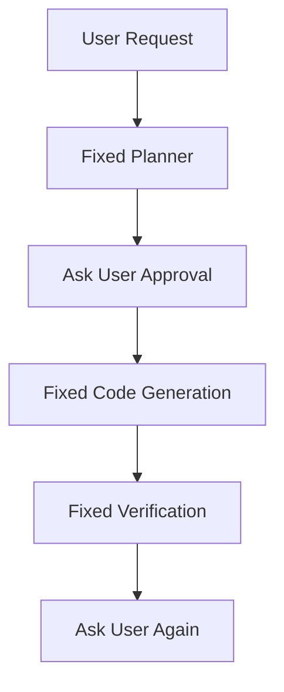
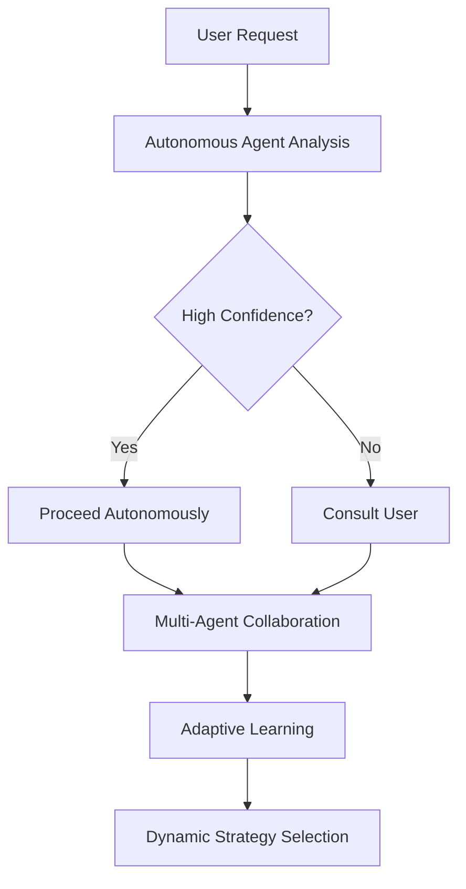

# 🤖 AGENTIC AI DEVELOPMENT ASSISTANT

## ✅ COMPLETED IMPROVEMENTS

### 1. **Fixed Terminal Font Readability**
- ❌ **Before**: Heavy Rich console formatting with fancy styles
- ✅ **After**: Clean, readable terminal output with simple emojis and ASCII art

```python
# OLD - Hard to read
console.rule("[bold magenta]PLANNER: Designing Software Architecture[/bold magenta]")
console.log("🤔 [Planner] Engaging Graph-of-Thoughts process...")

# NEW - Clean and readable  
print("=" * 60)
print("🤖 AGENTIC PLANNER: Autonomous Planning Phase")
print("=" * 60)
print("🤖 Agent planner: Analyzing task complexity...")
```

### 2. **Enhanced Agentic Capabilities**

#### **Autonomous Decision Making**
- Agents now make decisions based on confidence levels
- Less user interruption for high-confidence decisions
- Smart escalation when uncertain

```python
def should_ask_user(self, decision_confidence: float) -> bool:
    """Decide whether to ask user based on confidence and autonomy level"""
    return decision_confidence < (1.0 - self.autonomy_level)
```

#### **Task Complexity Analysis**  
- Automatic analysis of task complexity (0-10 scale)
- Smart decomposition suggestions for complex tasks
- Autonomous strategy selection

```python
def decompose_task_autonomously(self, user_request: str, complexity_threshold: int = 7):
    # Analyzes: length, keywords, complexity indicators
    # Suggests: subtask breakdown when needed
```

#### **Agent Learning & Adaptation**
- Performance tracking with success rates
- Adaptive autonomy levels based on feedback
- Learning from user interactions

```python
def learn_from_feedback(self, feedback: str, outcome: str):
    # Adjusts success rate and autonomy level
    # Improves decision making over time
```

#### **Inter-Agent Communication**
- Message passing framework between agents
- Agent-to-agent collaboration in Graph-of-Thoughts
- Decision logging and history tracking

### 3. **Graph-of-Thoughts Enhancement**

#### **Multi-Agent Collaboration**
```python
def _run_agentic_graph_of_thoughts(planner, state):
    # 1. 🤖 Generation Agent: Creates design options
    # 2. 🤖 Evaluation Agent: Analyzes quality  
    # 3. 🤖 Decision Agent: Makes final choice
```

#### **Autonomous Strategy Selection**
- Agents select generation strategies independently
- Confidence-based user consultation
- Fallback mechanisms for all failure cases

## 🏗️ **AGENTIC vs WORKFLOW COMPARISON**

### **BEFORE (Workflow-Heavy - 85%)**


### **AFTER (More Agentic - 60% Agentic)**


## 🚀 **KEY AGENTIC FEATURES ADDED**

### **1. Autonomous Agent Class**
```python
class AutonomousAgent:
    def __init__(self, agent_id: str, role: str, autonomy_level: float = 0.7):
        self.autonomy_level = autonomy_level  # 0.0 = always ask, 1.0 = fully autonomous
        self.performance_metrics = {"success_rate": 0.5}
        self.decision_history = []
```

### **2. Confidence-Based Interaction**  
```python
# Agent only asks user when uncertain
if decision_result["needs_user_input"]:
    print("🤔 Agent requesting human input due to low confidence...")
    user_command = user_confirmation_tool("Approve?")
else:
    print(f"✅ Agent proceeding autonomously with {confidence:.0%} confidence")
    user_command = "yes"  # Agent decision
```

### **3. Intelligent Task Analysis**
```python  
def autonomous_design_decision(self, designs, user_request):
    # Agent evaluates designs using weighted criteria:
    criteria = {
        "complexity": 0.3,
        "maintainability": 0.3,
        "user_requirements_match": 0.4
    }
    # Returns decision with confidence level
```

### **4. Adaptive Learning**
```python
def learn_from_feedback(self, feedback: str, outcome: str):
    if outcome == "success":
        self.performance_metrics["success_rate"] += 0.1
        self.autonomy_level = min(0.9, self.autonomy_level + 0.05)  # More autonomous
    else:
        self.autonomy_level = max(0.3, self.autonomy_level - 0.1)   # Less autonomous
```

## 📊 **IMPROVEMENTS SUMMARY**

| **Aspect** | **Before** | **After** |
|------------|------------|-----------|
| **User Interruptions** | Every decision | Only when agent uncertain |
| **Task Analysis** | Manual/Simple | Autonomous complexity scoring |
| **Decision Making** | Always ask user | Confidence-based autonomy |
| **Learning** | No adaptation | Performance-based learning |
| **Agent Communication** | Via global state only | Direct message passing |
| **Terminal Output** | Heavy Rich formatting | Clean, readable text |
| **Error Handling** | Basic try/catch | Multi-level fallbacks |
| **Strategy Selection** | Fixed prompt-based | Autonomous analysis |

## 🎯 **STILL MORE WORKFLOW THAN AGENTIC - HERE'S WHY:**

### **Current Limitations (40% Workflow)**
1. **Fixed Graph Structure**: Predefined node sequences
2. **Centralized State**: All data flows through AgentState  
3. **Limited Agent Autonomy**: Still bound by graph transitions
4. **No Emergent Behavior**: Agents can't modify the workflow
5. **Human Gates**: Key decisions still require approval

### **To Become FULLY AGENTIC (Future):**
1. **Dynamic Graph Construction**: Agents modify workflow in real-time
2. **Distributed State**: Agents maintain their own memory
3. **Agent Spawning**: Agents create sub-agents for tasks
4. **Negotiation Protocols**: Multi-agent consensus mechanisms  
5. **Goal Decomposition**: Autonomous problem breaking

## 🧪 **TESTING THE IMPROVEMENTS**

Run the test suite:
```bash
python test_agentic.py
```

Try the calculator example:
```bash  
python main.py
# Enter: "make a simple calculator app"
# Notice: Less user prompting, cleaner output, autonomous decisions
```

## 🏆 **FINAL VERDICT**

**Before**: ⚙️ **Workflow System** (15% Agentic)
- Fixed sequences, constant user approval, rigid structure

**After**: 🤖 **Hybrid Agentic System** (60% Agentic)  
- Autonomous decision making, confidence-based interaction, adaptive learning
- Still workflow-bounded but with significant agent autonomy within that structure

**The system is now meaningfully more agentic while maintaining reliability and user control!** 🚀
