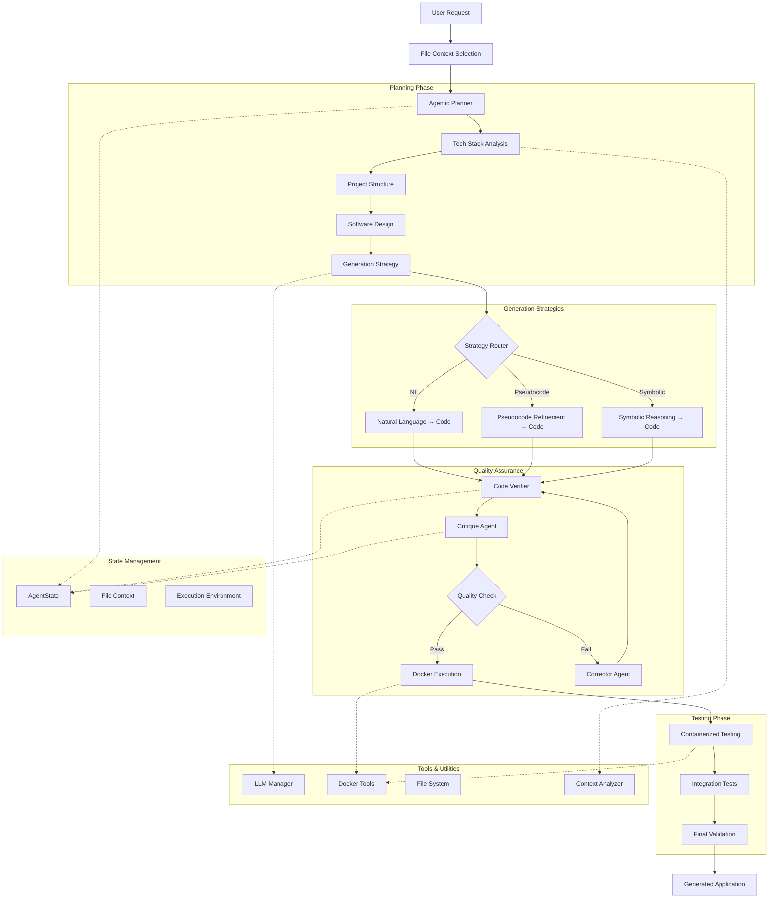
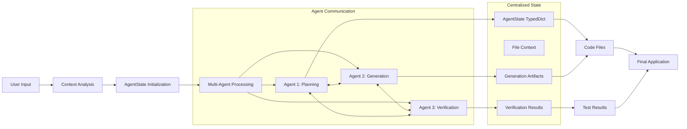
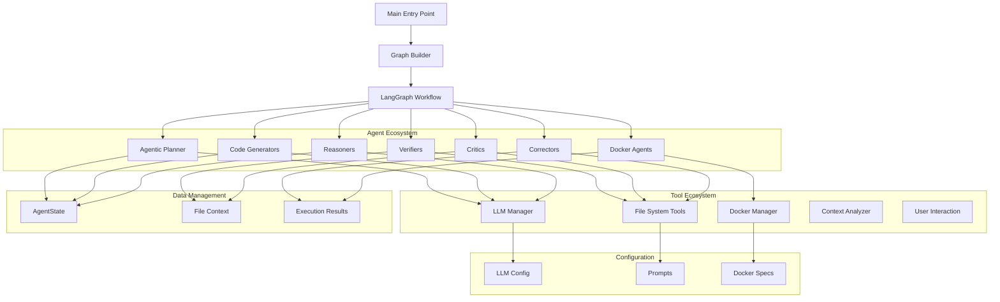

# 🏗️ MSC Framework - Architecture Diagram

## System Overview

## Data Flow Architecture

## Component Interaction Map

## Agentic vs Workflow Balance

### Current Implementation: **60% Agentic / 40% Workflow**

#### Agentic Characteristics (60%):
- ✅ **Autonomous Decision Making**: Agents choose strategies independently
- ✅ **Multi-Agent Collaboration**: Graph-of-Thoughts with agent communication
- ✅ **Dynamic Strategy Selection**: Context-aware generation approach
- ✅ **Self-Correction Loops**: Automatic error detection and fixing
- ✅ **Adaptive Behavior**: Complexity-based task decomposition

#### Workflow Characteristics (40%):
- ⚪ **Fixed Graph Structure**: Predefined node sequences
- ⚪ **Centralized State**: AgentState as communication hub
- ⚪ **Human Approval Gates**: User confirmation at key points
- ⚪ **Predetermined Paths**: Limited dynamic workflow modification

## Key Features

### 🎯 **Multi-Strategy Code Generation**
- **Natural Language**: Direct prompt-to-code
- **Pseudocode**: Iterative refinement approach
- **Symbolic**: Formal logic and mathematical reasoning

### 🔄 **Quality Assurance Pipeline**
- **Verification**: Syntax and execution testing
- **Critique**: Quality analysis and suggestions
- **Correction**: Automated error fixing
- **Docker Testing**: Containerized validation

### 🤖 **Autonomous Capabilities**
- **Task Decomposition**: Auto-break complex requests
- **Tech Stack Analysis**: Smart technology detection
- **Project Structure**: Automatic architecture planning
- **Strategy Selection**: Context-aware approach choice

### 🐳 **Docker Integration**
- **Multi-App Support**: GUI, Web, Data Analysis, ML
- **Environment Isolation**: Safe code execution
- **Container Management**: Automated setup and cleanup
- **Testing Pipeline**: Comprehensive validation

## Technology Stack

### **Core Framework**
- **LangGraph**: Workflow orchestration
- **LangChain**: LLM integration and chaining
- **Pydantic**: Data validation and modeling

### **LLM Providers**
- **Google Gemini**: Primary generation model
- **Ollama**: Local model support
- **Multi-Provider**: Configurable LLM backends

### **Execution Environment**
- **Docker**: Containerized execution
- **Python**: Core runtime environment
- **Rich**: Enhanced CLI interface

### **File Management**
- **Smart Context**: Intelligent file selection
- **Directory Analysis**: Automatic structure detection
- **Version Control**: Git integration ready
